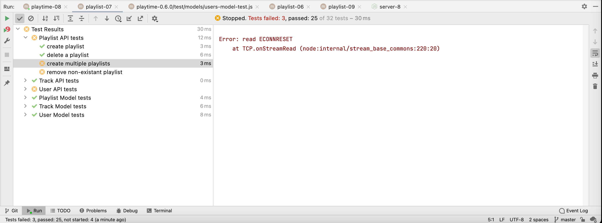

# Exercises

This is the Playtime application at the end of this lab:

- [playtime-0.7.0](https://github.com/wit-hdip-comp-sci-2023/full-stack-1/tree/main/prj/playtime/playtime-0.7.0)

## Exercise 1

Complete the implementation of the track api + tests.

## Exercise 2

Change the persistence strategy from "mongo" to "json" in the server:

#### server.js

~~~javascript
  db.init("json");
~~~

And also change this in the unit tests:

#### user-api-test.js

~~~javascript
  setup(async () => {
    db.init("json");
    ...
~~~

#### playlist-api-test.js

~~~javascript
  setup(async () => {
    db.init("json");
    ...
~~~

#### track-api-test.js

~~~javascript
  setup(async () => {
    db.init("json");
    ...
~~~

Run all tests. They may run correctly first time, but subsequent runs may fail:

It will fail unpredictably if you launched the servers using *nodemon*:

~~~bash
npm run dev
~~~

If you stop and restart the server normally:

~~~bash
npm run start
~~~

Then it should run reliably. Can you explain what might be happening?

### Exercise 3:

Currently when you run all tests:

~~~bash
npm run test
~~~

then all tests in the test folder are executed. We might like to run tests just in the api or model folders in isolation. How would you do this?
