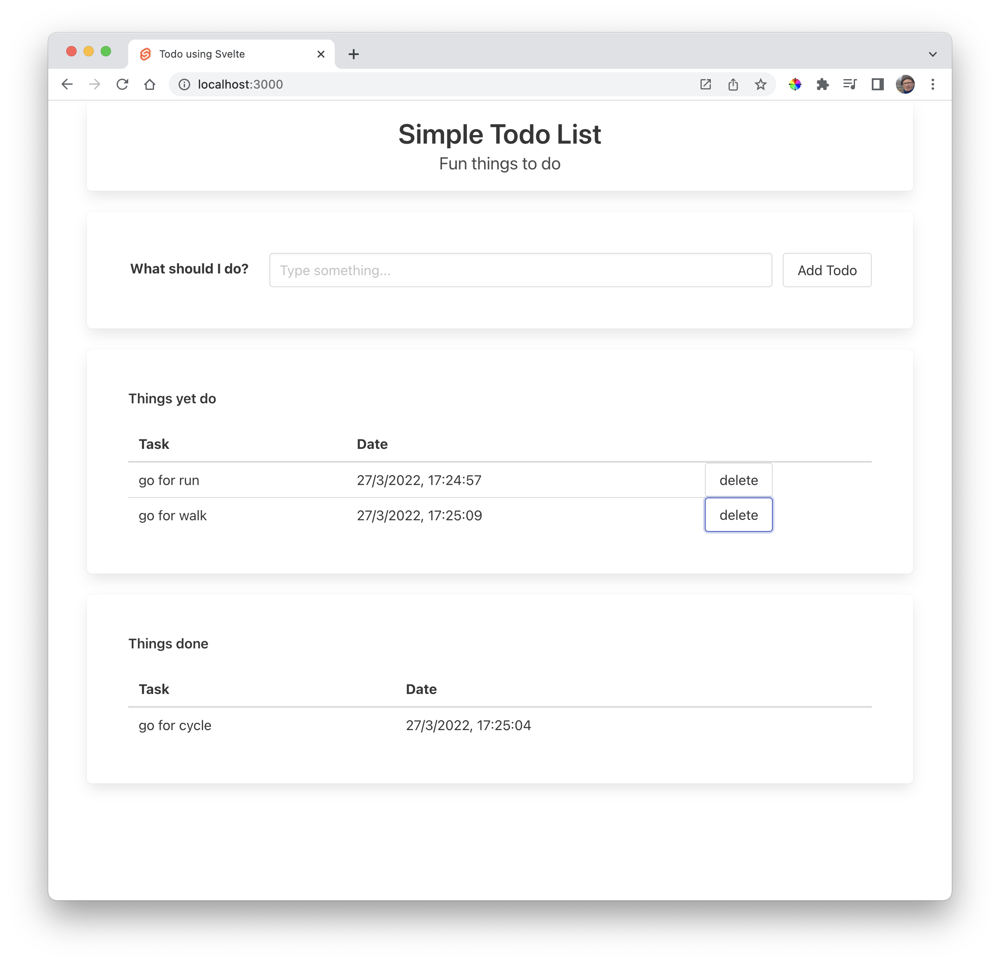

# Done List

Introduce a new array:

~~~javascript
  let doneItems = [];
~~~

Bring in our ID generator:

~~~javascript
  function uuidv4() {
    return "xxxxxxxx-xxxx-4xxx-yxxx-xxxxxxxxxxxx".replace(/[xy]/g, function (c) {
      var r = Math.random() * 16 | 0, v = c == "x" ? r : (r & 0x3 | 0x8);
      return v.toString(16);
    });
  }
~~~

Extend the todo object giving each todo item and id:

```javascript
const todo = {
  text: todoText,
  date: new Date().toLocaleString("en-IE"),
  id: uuidv4()
};
```

A new function to delete items:

~~~javascript
  function deleteTodo(id) {
    const found = todoItems.findIndex((todo) => todo.id == id);
    const done = todoItems[found];
    todoItems.splice(found, 1);
    todoItems = [...todoItems];
    doneItems.push(done);
    doneItems = [...doneItems];
  }
~~~

Now, append a new item to each row:

~~~html
      {#each todoItems as todo}
        <tr>
          <td> {todo.text} </td>
          <td> {todo.date} </td>
          <button on:click={deleteTodo(todo.id)} class="button">delete</button>
        </tr>
      {/each}
~~~

Finally, we can populate an `Items Completed` table:

~~~html
  <div class="section box">
    <div class="title is-6">Things done</div>
    <table id="done-table" class="table is-fullwidth">
      <thead>
        <th>Task</th>
        <th>Date</th>
        <th></th>
      </thead>
      <tbody>
        {#each doneItems as todo}
          <tr>
            <td> {todo.text} </td>
            <td> {todo.date}</td>
          </tr>
        {/each}
      </tbody>
    </table>
  </div>
~~~

This is how it now looks now:

