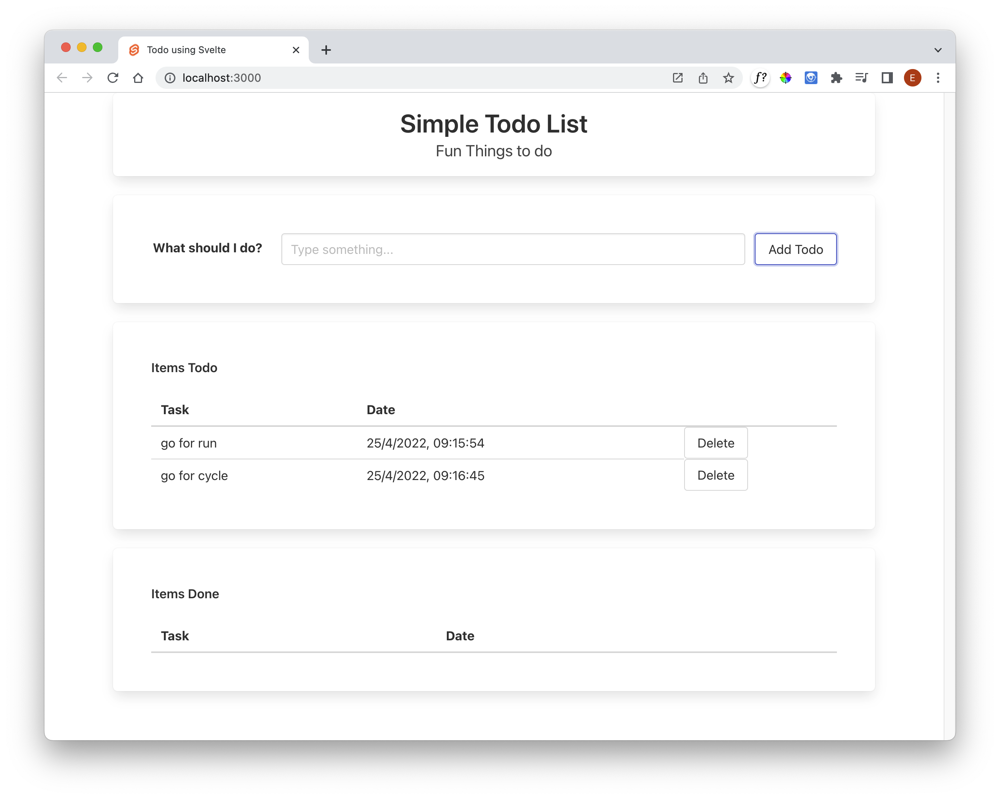

# Delete Button

In our original app, the `Items Todo` list had a button to delete an item, which was then moved to the `Items Done` list:



This is a revised version of `TodoList`:

### TodoList.svelte

```html
<script>
  export let caption;
  export let items = [];
  export let deleteSupport = false;
</script>

<div class="section box">
  <div class="title is-6">{caption}</div>
  <table class="table is-fullwidth">
    <thead>
      <th>Task</th>
      <th>Date</th>
      <th></th>
    </thead>
    <tbody>
      {#each items as todo}
        <tr>
          <td> {todo.text} </td>
          <td> {todo.date}</td>
          {#if deleteSupport}
            <button class="button">Delete</button>
          {/if}
        </tr>
      {/each}
    </tbody>
  </table>
</div>
```

Notice we are passing ` deleteSupport` boolean, which defaults to false. Then we display the button if it is true. Back in `App.svelte` we can enable the button for the first TodoList component:

### App.svelte

```html
<TodoList caption="Items Todo" items="{todoItems}" deleteSupport="true"/>
<TodoList caption="Items Done" items="{doneItems}"/>
```

The button should now appear on the Items Todo list - although it doesn't do anything yet (next step).


